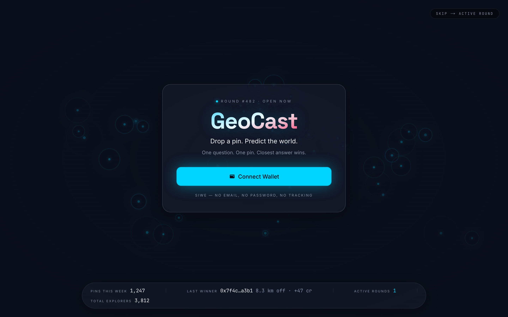
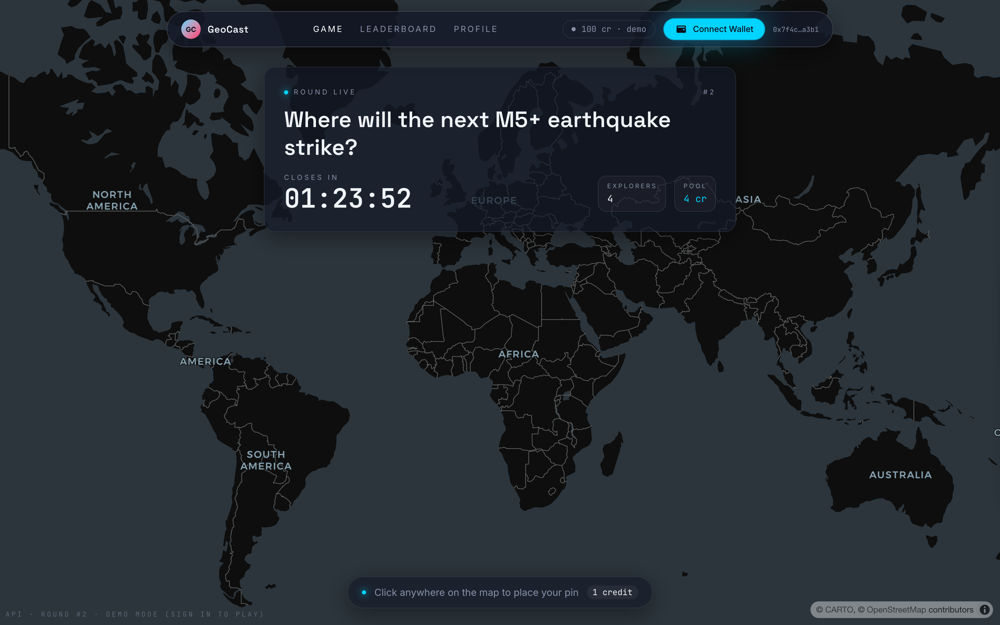
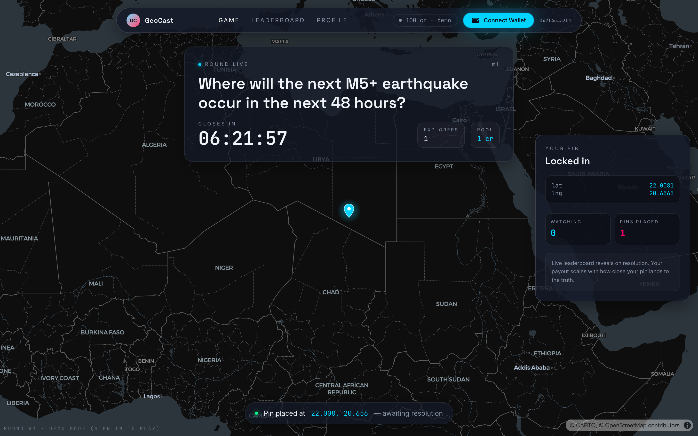
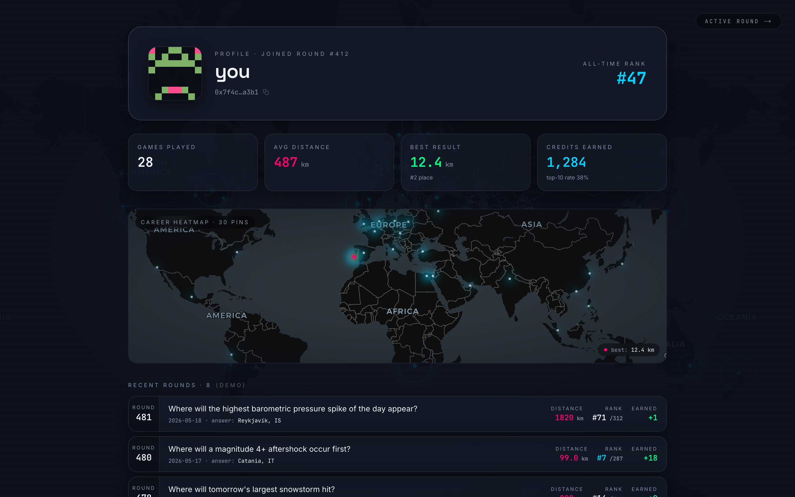
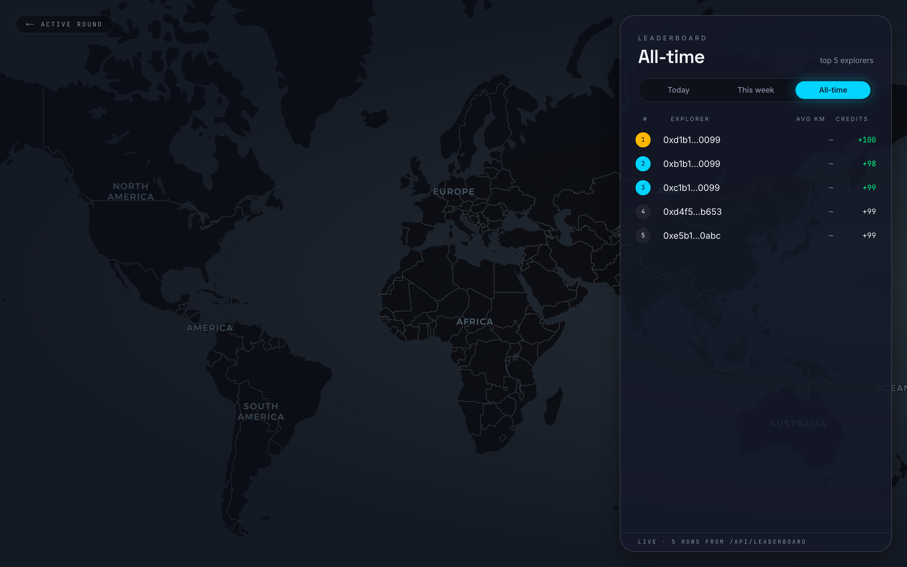
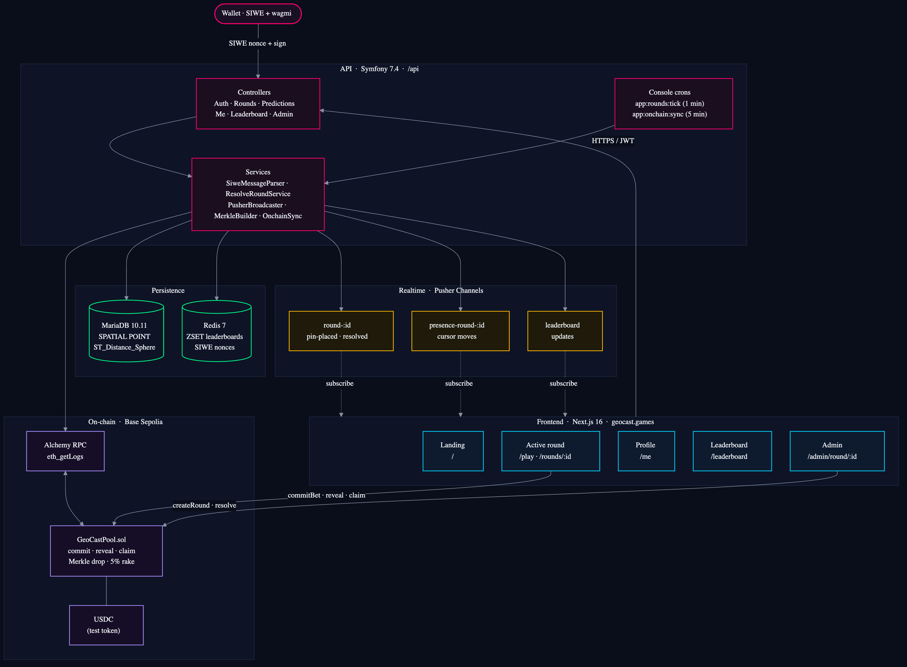

# GeoCast

> **Drop a pin. Predict the world.**
> Live at **[geocast.games](https://geocast.games)** · source on [GitHub](https://github.com/kindrakevich-agency/GeoCast)

A daily geo-prediction game. One question, one pin on a world map, one
chance — the closest guess takes the biggest share of the round pool.
Built solo as a senior full-stack portfolio piece: cinematic MapLibre
canvas on the front, Symfony 7 + MariaDB `SPATIAL` on the back, SIWE auth
with no email/password, real-time presence over Pusher, and an optional
on-chain pool on Base L2 using a custom commit-reveal contract with
Merkle-drop settlement.



---

## What's actually live

This isn't a roadmap. Everything below works in production at
[geocast.games](https://geocast.games) right now.

- **Daily rounds** — admin-created, cron promotes scheduled → open → closed
  on the wall clock (`app:rounds:tick`, every minute).
- **One pin per round** — enforced by a unique constraint, persisted to a
  `SPATIAL POINT` column on MariaDB with SRID 4326.
- **Cinematic active-round screen** — full-bleed MapLibre canvas (Carto
  Dark Matter, no API token), crosshair cursor, drop-with-ripple animation,
  glassmorphic question card, live "explorers playing" counter.
- **Real-time presence** — Pusher `presence-round-{id}` channel broadcasts
  cursor positions; you see other players' cursors hovering the map as
  they decide. Server emits `pin-placed` + `round-resolved` events on the
  public `round-{id}` channel.
- **Heatmap reveal** — once you've committed, the aggregate of every other
  pin renders as a cyan→magenta heat layer, anonymised server-side.
- **Resolution choreography** — once the answer pin is set (by the
  auto-resolver or manually), the camera `flyTo`s, a great-circle line
  draws from your pin to truth, your distance badge pulses in, confetti
  for top-10.
- **Auto-resolver framework** — pluggable `ResolverInterface` per question
  template. A nightly cron generates candidate questions; admin picks one
  to publish; when its `resolves_at` hits, another cron calls the source
  API (Open-Meteo for weather, USGS for earthquakes, etc.), gets the
  ground-truth coordinates, and resolves the round automatically.
  Nobody picks the winner — public APIs do. First live template:
  *"Hottest European capital tomorrow"* via Open-Meteo (~47 capitals,
  hourly tie-break, multi-winner fallback).
- **SIWE wallet auth** — EIP-4361 signature recovery via
  `kornrunner/secp256k1`, Redis-backed single-use nonces (5-min TTL,
  namespaced so they can't collide with co-tenants), JWT exchange.
- **Profile + career heatmap** — every pin you've ever dropped on one
  faded global heatmap. Personal, screenshot-worthy.
- **Three leaderboards** — today / this week / all-time, sourced from
  Redis sorted sets so reads stay sub-millisecond.
- **Admin tools** — round CRUD, geocoded resolution, search + on-chain
  mirroring badges per round, per-round URL (`/admin/round/{ulid}`).
- **v2 on-chain mode** — optional path: GeoCastPool contract on Base
  Sepolia, commit-reveal anti-cheat, 5% rake to treasury, Merkle-drop
  claims. Off-chain Merkle builder + event mirror runs as a cron.
- **Production deploy** — single SSH step in GitHub Actions, gated behind
  typecheck + container lint + composer validate. Cloudflare-proxied,
  Origin Cert, Hetzner box shared with two other projects without
  collisions.
- **SEO foundation** — programmatic favicon + apple-icon + 1200×630 OG
  (via `next/og`), dynamic per-round OG with the actual question + status
  pill in the preview, `robots.txt`, `sitemap.xml`, `manifest.webmanifest`,
  JSON-LD FAQPage/WebSite/Organization schemas.

---

## Stack

| Layer        | Tooling                                                                          |
|--------------|----------------------------------------------------------------------------------|
| Frontend     | Next.js 16 (App Router) · React 19 · TypeScript strict · Tailwind 4 · MapLibre · Framer Motion |
| Web3         | wagmi v2 · viem · RainbowKit · SIWE (EIP-4361)                                   |
| Backend      | Symfony 7.4 LTS · API Platform 4 · Doctrine ORM 3 · MariaDB 10.11 (`SPATIAL POINT` + `ST_Distance_Sphere`) |
| Realtime     | Pusher Channels — `round-{id}`, `presence-round-{id}`, `leaderboard`             |
| Caching      | Redis 7 (ZSET leaderboards + SIWE nonces)                                        |
| Auth         | LexikJWTAuthenticationBundle · `kornrunner/secp256k1` + `kornrunner/keccak`     |
| Contracts    | Solidity 0.8.24 · Foundry · OpenZeppelin · deployed to Base Sepolia              |
| Infra        | Docker Compose · nginx → php-fpm 8.3 · Cloudflare in front · Hetzner VPS         |
| CI/CD        | GitHub Actions — typecheck + build + `lint:container` + composer validate gate, then SSH deploy |

54 PHP source files (controllers + services + entities + commands),
79 TS/TSX files, 5 Doctrine migrations, 9 Foundry contract tests, 7
PHPUnit test files
covering the math-critical paths (Merkle builder, event decoder, scoring).

---

## The screens

| Screen          | Highlight                                                                       |
|-----------------|---------------------------------------------------------------------------------|
| Landing         | Drifting dark world map · pulsing pins · glass auth card · SEO long-form below   |
| Active round    | Crosshair cursor · pin drop with spring + triple ripple · live presence dots     |
| Pin placed      | Side panel slides in · heatmap reveal · bottom hint switches to "awaiting resolution" |
| Resolution      | Camera `flyTo` · great-circle line · distance badge · leaderboard slide-in · confetti for top-10 |
| Profile (`/me`) | Career heatmap of every pin · stats grid · recent-rounds timeline                |
| Leaderboard     | Slide-in modal — today / week / all-time tabs                                   |






### Regenerating the screenshots

Screenshots live in `docs/screenshots/` and are captured from the live
site by a small Playwright script. Run it after any UI change:

```bash
pnpm dlx playwright@latest install chromium
node infra/scripts/capture-screenshots.mjs
# Or against a local dev server:
node infra/scripts/capture-screenshots.mjs --base http://localhost:3000
```

---

## Architecture



Source-of-truth is [`docs/architecture.mmd`](docs/architecture.mmd)
(Mermaid). Regenerate the PNG after editing:

```bash
bash infra/scripts/render-architecture.sh
```

### API surface (excerpt)

```
POST  /api/auth/nonce             SIWE — Redis nonce (5min TTL, namespaced)
POST  /api/auth/verify            secp256k1 recovery → JWT (30d TTL)

GET   /api/rounds/current         live round or null
GET   /api/rounds/{id}/my-prediction   own pin (cross-reload hydration)
GET   /api/rounds/{id}/pins       anonymised heatmap pins (post-commit)
GET   /api/rounds/{id}/claim-proof     Merkle proof + leaf amount

GET   /api/me                     profile + stats
GET   /api/me/predictions         paginated history
GET   /api/me/career-pins         career heatmap coordinates

GET   /api/leaderboard?period=today|week|all   top 100 from Redis ZSET
GET   /api/stats                  landing-page metrics

POST  /api/admin/rounds/{id}/settle           build Merkle tree + persist proofs
                                              (called by the auto-resolver cron)

POST  /api/pusher/auth            presence-channel auth callback
GET   /api/health                 liveness probe
```

---

## Auto-resolver framework

Rounds don't need a human anywhere in the loop. Every question template
ships paired with a resolver — a small PHP class that knows two things:
how to *propose* a candidate question, and how to *resolve* it from a
public API when its time comes. The cron drives the whole pipeline.

```
┌──────────────────┐      ┌────────────────────┐      ┌─────────────────┐
│ app:questions:   │      │  auto-publish:     │      │ app:rounds:     │
│ suggest          │─────►│  Round row +       │─────►│ auto-resolve    │
│  --continuous    │      │  on-chain mirror   │      │  (every 5 min)  │
│  --ensure-queued │      │  via cast send     │      └────────┬────────┘
│  (every 5 min)   │      └────────────────────┘               │
└──────────────────┘                                            ▼
        │                                          ResolverInterface.resolve()
        ▼                                              - reads observed/actual
ResolverInterface.suggest()                            - returns ResolutionResult
   - reads forecast/state                                (points[] + audit log)
   - returns SuggestionDraft                                   │
     (question + window + params)                              ▼
                                                  ResolveRoundService.resolveMulti()
                                                    ▶ rank, payout, leaderboards
                                                    ▶ on-chain settle (Merkle root)
                                                    ▶ Pusher broadcast
```

### What's wired

| Source | Status | Templates |
|---|---|---|
| **Open-Meteo** (forecast + archive) | **Live** | `openmeteo.hottest-european-capital` |
| **USGS Earthquakes** (FDSN feed) | Queued | next-M5+, strongest-week |
| NASA FIRMS · GDELT · NOAA | Planned | wildfire, geo-news, aurora |

`HottestEuropeanCapitalResolver` is the canonical example
(`apps/api/src/Service/Questions/Resolver/`):

1. **`suggest()`** — hits Open-Meteo's forecast endpoint for ~47
   European capitals, ranks by daily max temperature, writes a
   `SuggestionDraft` with question text + opens/closes/resolves
   timestamps + a top-5 preview snapshot the admin sees.
2. **`resolve()`** — at `resolves_at` (06:00 UTC the day after close,
   to give the archive endpoint time to populate), hits the archive
   endpoint for the same 47 cities. Picks the city with the highest
   `temperature_2m_max`. If two cities tie within 0.05°C on the daily
   aggregate, a second call to the hourly endpoint splits the tie at
   0.1°C precision. If a true tie survives, the round resolves
   *multi-winner* — `Round.answer_points` carries the full list and
   each prediction's `distance_km` is computed as
   `LEAST(d_to_winner_1, d_to_winner_2, …)`.

Adding a new resolver = one class implementing `ResolverInterface`,
auto-registered via the `app.question_resolver` DI tag. No wiring,
no boilerplate, no admin-UI changes — the sidebar picks it up
automatically.

PHPUnit coverage in `tests/Service/Questions/`:

- `OpenMeteoClientTest` — multi-city order preservation, single-city
  vs array response shape, null handling on missing data, 5xx propagation.
- `HottestEuropeanCapitalResolverTest` — clear single winner, daily
  tie broken by hourly probe, true multi-winner survives both stages,
  missing-`date` param rejection.

---

## On-chain settlement

Every round settles in test USDC on Base Sepolia. There is no credit
fallback — pin placement requires a wallet signature + 1 USDC commit
into `GeoCastPool`. (Test USDC is mintable on demand from a button on
the round page.)

- `contracts/src/GeoCastPool.sol` — single contract, ~300 LOC.
- **Commit-reveal** anti-cheat: the player commits
  `keccak256(player, lat, lng, salt)`, salt stashed in localStorage,
  reveal opens after the round closes.
- **5% rake** to a treasury Safe; the remaining 95% is distributed to
  players by inverse-distance weighting.
- **Merkle-drop settlement** — off-chain `MerkleBuilder` computes the
  tree from revealed pins; the server-side resolver wallet posts the
  root via `GeoCastPool.resolve()`; players pull their share via
  `claim(amount, proof)` against
  `bytes.concat(keccak256(abi.encode(player, amount)))` (matches OZ
  `MerkleProof.verify` with sorted-pair encoding).
- **Server-side mirror** — `OnchainBroadcaster` shells out to `cast send`
  on every new round (createRound → tx) and every resolved round
  (resolve → tx). `OnchainSync` polls Base via `eth_getLogs` in
  1,000-block windows with 2-block confirmations, persists to an
  `onchain_events` log with `UNIQUE(chain_id, block_number, log_index)`
  for idempotency. Both run as Symfony console commands via cron.

The admin pane has no manual lifecycle controls — `/admin/round/{id}`
is read-only. Round creation, on-chain mirror, lifecycle transitions,
and on-chain settle all happen via the cron pipeline.

Why testnet only: this is a portfolio piece, not a regulated product. The
architecture is real; the dollars are pretend.

---

## Scoring

For a prediction at haversine distance `d` (km) from the answer:

```
raw_score = 1 / (1 + d)
payout    = floor(0.95 × pool_usdc × raw_score / Σ raw_scores)
```

That curve gives the closest pin the biggest share without making it
winner-takes-all — a pin 2,000 km off still earns a sliver, which keeps
casual play engaging. Total payouts always ≤ pool (rounding stays in the
protocol bucket). The user's `total_score` is the cumulative sum of
`raw_score` across every resolved round, indexed in a Redis ZSET for the
all-time leaderboard.

Distance is computed server-side in MariaDB via `ST_Distance_Sphere` on
the indexed `SPATIAL POINT` column — ranking thousands of pins on round
resolution is sub-second.

---

## Quick start

### Dev (mock data, no Docker)

```bash
git clone https://github.com/kindrakevich-agency/GeoCast.git
cd GeoCast
pnpm install
pnpm dev                # Next.js on http://localhost:3000
# open http://localhost:3000 for the landing screen
```

### Full stack (Docker)

```bash
cp .env.example .env       # fill in real values
docker compose up -d
# web :3000 · API behind nginx :8080 · MariaDB :3306 · Redis :6379
```

Database migrations and seed data run automatically on first start
(idempotent). Visit `http://localhost:3000` and the landing canvas
boots immediately; sign in with any EVM wallet via the Connect button.

### Auth flow (SIWE)

```
1. Wallet  →  POST /api/auth/nonce   { address }
                                     → { nonce, address, expiresIn }

2. Wallet signs an EIP-4361 message containing that nonce.

3. Wallet  →  POST /api/auth/verify  { message, signature }
                                     → { token, user }

4. Subsequent requests carry  Authorization: Bearer <token>.
```

The nonce is single-use, Redis-backed with a 5-minute TTL, and namespaced
`geocast:siwe:nonce:<address>` so it can never collide with other apps
sharing the same Redis instance. JWTs are signed by a Lexik-generated
ed25519 keypair (`bin/console lexik:jwt:generate-keypair --skip-if-exists`).

---

## Project structure

```
.
├── apps/
│   ├── web/                Next.js 16 + Tailwind 4 + MapLibre
│   │   └── src/
│   │       ├── app/        App Router routes
│   │       │   ├── page.tsx              landing (hero + how + scoring + stats + CTA + SEO)
│   │       │   ├── play/                 SSR redirect to /rounds/{current}
│   │       │   ├── rounds/[id]/          active + resolved round screen
│   │       │   ├── me/                   profile + career heatmap
│   │       │   ├── leaderboard/          slide-in modal
│   │       │   ├── admin/                round CRUD + on-chain mirror
│   │       │   ├── icon.tsx              programmatic favicon
│   │       │   ├── opengraph-image.tsx   1200×630 OG (next/og)
│   │       │   ├── rounds/[id]/opengraph-image.tsx  per-round OG
│   │       │   ├── robots.ts · sitemap.ts · manifest.ts
│   │       ├── components/ map · round · ui primitives · auth
│   │       ├── hooks/      useAuth · usePusherChannel · usePresenceCursors · useCommitBet · …
│   │       └── lib/        api client · onchain config · mock helpers
│   └── api/                Symfony 7.4 + API Platform 4
│       ├── src/
│       │   ├── Controller/     RoundsController · PredictionsController · MeController · LeaderboardController · AdminRoundsController · AdminSuggestionsController · …
│       │   ├── Service/
│       │   │   ├── Siwe/                 SiweMessageParser · SiweVerifier · SiweNonceService
│       │   │   ├── Broadcast/            PusherBroadcaster
│       │   │   ├── Round/                ResolveRoundService (multi-winner) · RoundService
│       │   │   ├── Onchain/              MerkleBuilder · OnchainSync · SettlementBuilder
│       │   │   └── Questions/            ResolverInterface · ResolverRegistry
│       │   │       ├── Resolver/         HottestEuropeanCapitalResolver · …
│       │   │       └── Source/           OpenMeteoClient · EuropeanCapitals
│       │   ├── Entity/         User · Round · Prediction · RoundSuggestion (ULIDs + SPATIAL coords)
│       │   ├── Command/        app:rounds:tick · app:onchain:sync · app:questions:suggest · app:rounds:auto-resolve
│       │   └── Security/       JwtAuthenticator · AdminVoter
│       └── migrations/         5 Doctrine migrations
├── contracts/              Foundry — GeoCastPool.sol + MockUSDC.sol + tests
├── infra/
│   ├── nginx/api.conf
│   └── scripts/capture-screenshots.mjs
├── docs/screenshots/
└── .github/workflows/ci.yml
```

---

## Deployment

Production target is a single Hetzner VPS (Ubuntu 24.04 + aaPanel),
shared with two other production apps without collision. The deploy is
git-driven — push to `main`, GitHub Actions runs typecheck + build +
container lint + composer validate, then SSH-deploys via
`appleboy/ssh-action`.

```yaml
# .github/workflows/ci.yml (excerpt)
deploy:
  needs: [frontend, php]
  if: github.event_name != 'pull_request' && github.ref == 'refs/heads/main'
  steps:
    - uses: appleboy/ssh-action@v1.2.5
      with:
        host: ${{ secrets.SERVER_IP }}
        username: root
        key: ${{ secrets.SSH_PRIVATE_KEY }}
        envs: NEXT_PUBLIC_WALLETCONNECT_PROJECT_ID, NEXT_PUBLIC_PUSHER_*, NEXT_PUBLIC_GEOCAST_*
        script: |
          cd /www/wwwroot/geocast/...
          git reset --hard origin/main
          composer install --no-dev --optimize-autoloader --no-scripts
          APP_ENV=prod bin/console cache:clear --no-warmup
          APP_ENV=prod bin/console cache:warmup
          APP_ENV=prod bin/console doctrine:migrations:migrate --no-interaction --allow-no-migration
          /etc/init.d/php-fpm-83 restart
          NEXT_PUBLIC_API_URL=https://geocast.games/api ... pnpm --filter ./apps/web build
          fuser -k -n tcp 3010 ; bash /.../geocast.sh
```

Some hard-won deploy lessons baked into the workflow:

- **Nuke `.next` before every build** — webpack/Turbopack caches have bitten
  more than once with stale-chunk SSR bugs.
- **`fuser -k -n tcp 3010`** instead of relying on the PID file — when Node
  is started outside aaPanel's panel script the PID file goes stale and a
  PID-based kill leaves an orphaned `next-server` holding the port with
  the old bundle.
- **`--webpack` flag on `next build`** — Turbopack's SSR chunk emitter has
  bitten us on hook orphan chunks; webpack is reliable.
- **PHP-FPM `restart`, not reload** — `opcache.validate_timestamps=0` on
  prod means a reload doesn't pick up new PHP files.

---

## Author

Built solo by [Vitalii Kindrakevych](https://github.com/kindrakevich-agency)
as a senior full-stack portfolio piece. MIT licensed.

If something here interests you and you're hiring — say hi:
[boss@prodaj.com.ua](mailto:boss@prodaj.com.ua).
